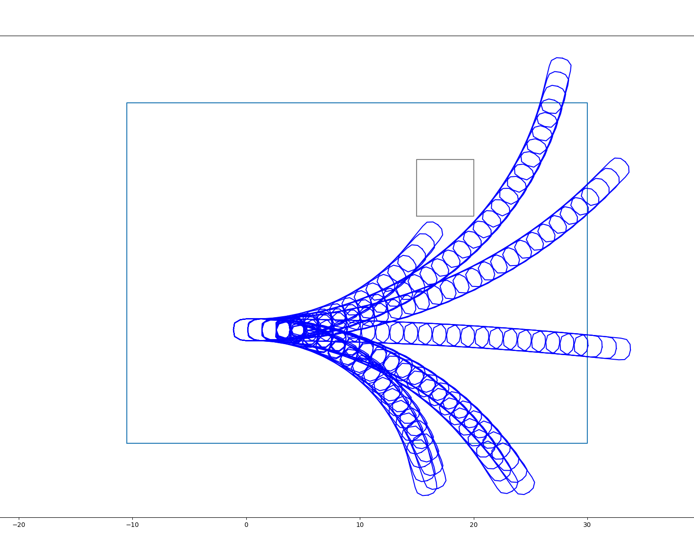
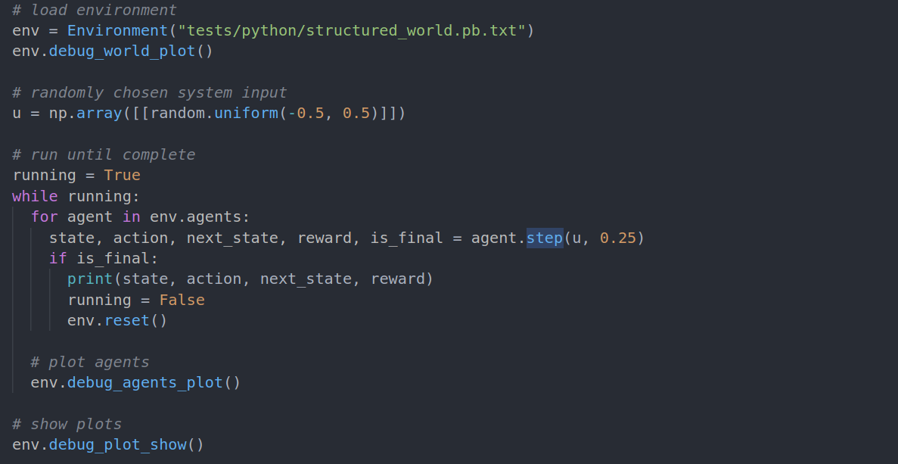

# divine_rl
**Div**e **in**to r**e**inforcement learning
This library provides a simple environment for planning autonomous vehicles using reinforcement learning.

Environment debug plots:

## Installation
Start by executing `bash install.sh` which will install bazel, python3 and create a virtual python environment.
In order to activate the virtual python environment run `source dev_into.sh`.

## Usage
* Build everything: `bazel build //...`
* Test everything: `bazel test //...`
* Run the environment: `bazel run //src/environment:environment`

In the screenshot below a minimal code example is shown:
