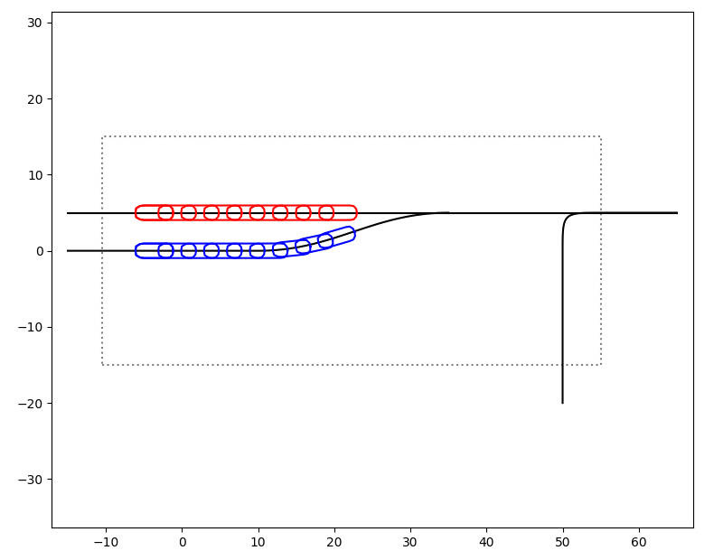

# Dive Into Reinforcement learning (divine-rl)
This library is intended to provide an environment for planning behaviors of autonomous vehicles using reinforcement learning. The name is derived from the initial intention of this library which is to provide a basic dive into the world of reinforcement learning (**Div**e **In**to r**E**inforcement learning).

Running the command `bazel run //src/divine:run` will produce the following output:

## Installation
Getting started is simple. Just run `bash install.sh` which will install all the necessary prerequisites and a virtual python environment. You can access it using `source dev_into.sh`.

## Usage
Before you run any of the commands provided below, make sure you are in the virtual python environment.

* Build everything: `bazel build //...`
* Test everything: `bazel test //...`
* Run the environment: `bazel run //src/divine:run`

The code executed running `bazel run //src/divine:run` is shown in the image below:

